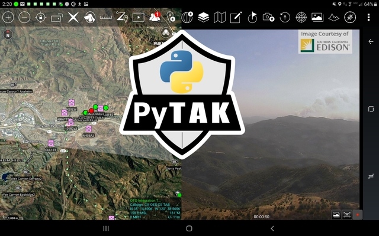

# TAKProto - Python TAK Protocol Module

TAKProto is a Python module for encoding & decoding TAK Protocol Payloads, for use with [TAK Products](https://tak.gov) including ATAK, WinTAK, iTAK, TAKX, TAK Tracker & TAK Server. `takproto` includes functions for converting TAK Protocol Protobuf messages as Python objects, and serializing CoT XML messages as Protobuf.

[Documentation is available here.](https://takproto.rtfd.io).

