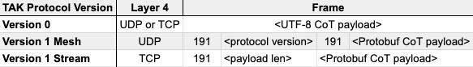

# TAK Protocol Description

From the [ATAK source](https://github.com/deptofdefense/AndroidTacticalAssaultKit-CIV/blob/master/commoncommo/core/impl/protobuf/protocol.txt):

    Version 1 of the TAK Protocol Payload is a Google Protocol Buffer based
    payload.  Each Payload consists of one (and only one)
    atakmap::commoncommo::v1::TakMessage message which is serialized using
    Google protocol buffers version 3.

Originally the TAK Products spoke Cursor on Target (CoT) encoded as plain XML. Later versions of the TAK Products added support for sending CoT as Google Protobuf, which TPC named 'TAK Protocol Version 1'.

Out of the box, TAK Products such as ATAK and WinTAK configured for 'Mesh SA' will send TAK Protocol Version 1 Mesh formatted CoT. This format utizes a static payload header of the format `191 1 191 <payload>`.

TAK Products configured for connecting to a TAK Server will send TAK Protocol Version 1 Stream formatted CoT. This format utizes a dynamic payload header of the format `191 <varint payload length> <payload>`. This header format is required for specifying the size of the payload within the TCP packet.

The `takproto` module supports encoding and decoding all 3 formats of CoT messages.

